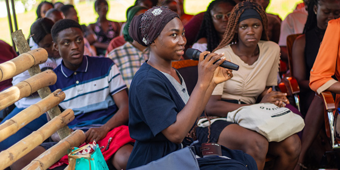
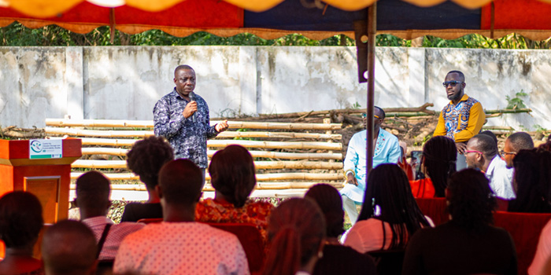
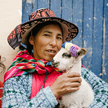

The Climate and Development Knowledge Network (CDKN), in collaboration with the Okyeame Kwame (OK) Foundation, and Centre for Climate Change and Sustainability Studies (C3SS), University of Ghana, hosted a conversation on Art and Climate Activism as part of the Centre’s Climate Change and Sustainability Seminar Series.

The Seminar, which took place on November 25, 2023, at the C3SS premises, represents an important step in bridging the gap between science, knowledge and practice on climate change and sustainable development knowledge brokerage using creative arts.

More than seventy graduate and undergraduate students from diverse university departments—including the Institute for Environment and Sanitation Studies (IESS), Geography and Resource Development, and the School of Performing Arts—attended the event.

CDKN Ghana's Country Engagement Lead, Dr. Prince Ansah, underscored that this undertaking is in line with the organization's dedication to bridging the divide between policy and technical aspects of climate change, as well as innovative arts-based strategies for climate action.

The event's keynote speaker was the renowned Ghanaian musician, songwriter, creative director, entrepreneur, and climate activist, Okyeame Kwame.

In his address, he placed significant emphasis on the necessity of integrating climate action into popular culture, specifically concerning climate justice and climate literacy.

Okyeame advocated for student researchers to transcend academic boundaries and employ innovative channels of communication, such as photography, social media, and virtual communication, to publicize their research outcomes.

In addition to discussing the human-caused causes of climate change, Okyeame Kwame highlighted the importance of taking simple steps to reduce emission footprints.

The musician provided practical examples, such as managing household water and energy usage, and advocated for a shift in the narrative from tree planting to tree growing, emphasizing the importance of responsibility and ownership in environmental stewardship.

In closing his address, Okyeame Kwame encouraged the participants to become volunteers for the OK Foundation.

The Director of C3SS, Professor Kwadwo Owusu, expressed his excitement about the seminar and encouraged students to become change agents. He stressed the importance of maintaining the scientific and technical foundations of climate science as tools for advocacy. He also mentioned that the Vice Chancellor of the University of Ghana lauded this cross-sectoral approach, recognizing its potential in enhancing experiential learning.

Dr. Yaw Agyeman Boafo, Senior Research Fellow and Programmes Coordinator at C3SS and moderator of the event, concluded by emphasising the significance of these seminars in fostering collaborative networks for sustainable climate action in Ghana and the sub-region.

He stated the C3SS's effort to bring more activists and practitioners to present at the seminar.

Several students in attendance at the seminar recounted personal experiences and involvements in climate action within various institutions, including communities, schools, and churches. They ranged from livelihood empowerment, recycling, artificial intelligence, disaster risk management, and gender equity.

CDKN Ghana launched a climate advocacy prize in partnership with C3SS to recognise students who can develop inventive concepts that promote climate justice and literacy.

<!-- > Contrary to popular belief not simply random has roots in a piece of classical Latin literature making it over 2000 years old Latin professort looked up one of the more.

Contrary to popular belief, Lorem Ipsum is not simply random text. It has roots in a piece of classical literature from 459, making it over 2000 years old. Richard McClintock, a Latin professor at Virginia looked up one of the more obscure Latin words, consectetur, from a Lorem Ipsum passage, and going through the cites of the word in classical literature, discovered the undoubtable source. Lorem Ipsum comes from written in 45 BC. This book is a treatise on the theory.

Contrary to popular belief, Lorem Ipsum is not simply random text. It has roots in a piece of classical literature from 459, making it over 2000 years old. Richard McClintock, a Latin professor at Virginia looked up one of the more obscure Latin words, consectetur, from a Lorem Ipsum passage, and going through the cites of the word in classical literature.

    

        
    

    

        
    

    

        
    

#### Children Education Needs For Change The World.

Contrary to popular belief, Lorem Ipsum is not simply random text. It has roots in a piece of classical literature from 459, making it over 2000 years old. Richard McClintock, a Latin professor at Virginia looked up one of the more obscure Latin words, consectetur, from a Lorem Ipsum passage, and going through the cites of the word in classical literature, discovered the undoubtable source. Lorem Ipsum comes from written in 45 BC. This book is a treatise on the theory.

Contrary to popular belief, Lorem Ipsum is not simply random text. It has roots in a piece of classical literature from 459, making it over 2000 years old. Richard McClintock, a Latin professor at Virginia looked up one of the more obscure Latin words, consectetur, from a Lorem Ipsum passage, and going through the cites of the word in classical literature. -->
