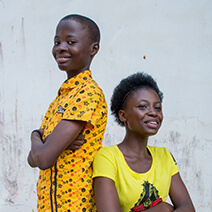
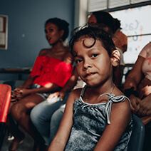
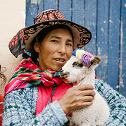

_The changing climate in northwest Ghana puts farming livelihoods and food security at risk. Now a project with multiple strands -- from youth engagement, to mobile phone apps, to community outreach centres -- is empowering farmers with the knowledge they need to innovate and adapt. Prince Ansah and Lucia Scodanibbio report._

In the Upper West region of Ghana, dry spells are becoming more frequent as a result of climate change – and affecting farming, the primary livelihood in the area.

In this region, the Adaptation at Scale in Semi-Arid Regions (ASSAR) project has focused on building community members’ resilience for food security by developing knowledge and capacity in the Lawra and Nandom districts.

In the early phases of the project, researchers found that social dynamics such as governance structure, development agenda and gender/social differentiation serve as barriers to adaptation and also provide opportunities for building community resilience against climate risk impact for agriculture intensification. They worked closely with community members to validate these early findings; engaging local leaders early on built trust and enthusiasm, and paved the way for broader community engagement during the later phases of the project.

**Planning to transform farming**

The project used a Transformative Scenario Planning (TSP) model (see how it works in this video) to envisage the future of agriculture and food security in the Upper West region. TSP workshops brought a diverse range of stakeholders together, who identified five areas of work that would require ‘concerted efforts for promoting agriculture intensification and achieving food security in the region by 2035’:

-   • Disaster risk reduction
-   • Ecosystem management
-   • Sustainable food and livelihood adaptation
-   • Improved market systems
-   • Climate-smart water management

At the root of these five strategic action areas are two key issues: access to water and political commitment to sustainable development. The project designed capacity building and communications activities around each strategic area, to work with target audiences and vulnerable groups according to their needs.

**Young people’s involvement makes project ‘fit for the future’**

The TSP process revealed that raising awareness about climate and environmental issues among youth in vulnerable communities of the Lawra and Nandom Districts is crucial to building sustainable capacity to adapt to climate change in the region.

An ASSAR Small Opportunities Grant (SOG) was used to develop a competition for senior high schools to raise awareness about local climate and environmental challenges, and promote the development of solutions by students. The Climate Change Adaptation Through Youth Innovation (CATYI) competition promoted dialogue and information exchange among students and enhanced their capacity to identify and communicate local adaptation issues.

The ASSAR team first toured senior high schools in the region to raise awareness about climate and sustainability issues, then invited students to form teams and submit solutions to address the five strategic challenge areas. A total of six teams from Birifoh, Lawra and Nandom senior high schools, were selected to make oral presentations in the finals; and judges selected the winners as follows:

-   • Save the Forest (ecosystem management) by the Pundits Team (Nandom Senior High School)
-   • Assisting women to establish woodlots for fuelwood (ecosystem management) by the Tierebio Fuelwood Growers Team (Lawra Senior High School)
-   • Extraction and improvement of groundnut oil and cakes (kulikuli) (sustainable livelihood empowerment) by the Mwinnebangfo Team (Lawra Senior High School).

The competing schools received cash prizes, educational materials and certificates. The ultimate winners, the PUNDITS from the Nandom Senior High School won a three day trip to the capital city, Accra, which featured visits with the University of Ghana and key national institutions including the Ministry of Environment Science Technology and Innovation (MESTI) and environmental NGOs.

**Taking climate-smart farming advice into communities**

Prioritisation of climate-smart water management during the TSP directly led the team to work with farmers on promotion of dry season farming through smart water management that enhances sustainable livelihoods for vulnerable communities.

The TSP also highlighted the need for more and better dissemination of research findings, weather and climate information, and adaptation strategies to stakeholders. Due to the challenges associated with limited existing communication channels the team created four Climate Advisory Resource Centres (CARCs) and supported the centres with mobile agriculture extension units to make farming advisories more meaningful and relevant to ordinary farmers and to support extension work.

Taking advantage of high internet usage and smartphone penetration in Ghana, an online platform was devised to remove barriers caused by poor information dissemination channels and close knowledge gaps between researchers, extension agents and development workers. Through a partnership with a mobile application development startup and other institutions, a simple app, called Adaptation Hub was designed, serving as a knowledge hub to share ASSAR findings, receive and disseminate feedback, create profiles and share information on climate and adaptation in the region and beyond.

The marriage between ASSAR’s research findings and the TSP workshops resulted in a clear understanding of the barriers and key areas that needed targeting to achieve more effective, widespread and sustained adaptation responses. The capacity building and communications activities that followed sought to strengthen the ability of strategic stakeholders to act to remove such barriers, to enhance vulnerable populations’ adaptive capacity and wellbeing. All activities were linked with local and national institutions already working in the districts to ensure sustainability of these actions beyond the timelines of the ASSAR project.

_Image: water pump, Ghana, courtesy Mairi Dupar, ESPA_

<!-- > Contrary to popular belief not simply random has roots in a piece of classical Latin literature making it over 2000 years old Latin professort looked up one of the more.

Contrary to popular belief, Lorem Ipsum is not simply random text. It has roots in a piece of classical literature from 459, making it over 2000 years old. Richard McClintock, a Latin professor at Virginia looked up one of the more obscure Latin words, consectetur, from a Lorem Ipsum passage, and going through the cites of the word in classical literature, discovered the undoubtable source. Lorem Ipsum comes from written in 45 BC. This book is a treatise on the theory.

Contrary to popular belief, Lorem Ipsum is not simply random text. It has roots in a piece of classical literature from 459, making it over 2000 years old. Richard McClintock, a Latin professor at Virginia looked up one of the more obscure Latin words, consectetur, from a Lorem Ipsum passage, and going through the cites of the word in classical literature.

    

        
    

    

        
    

    

        
    

#### Old Education Needs For Change The World.

Contrary to popular belief, Lorem Ipsum is not simply random text. It has roots in a piece of classical literature from 459, making it over 2000 years old. Richard McClintock, a Latin professor at Virginia looked up one of the more obscure Latin words, consectetur, from a Lorem Ipsum passage, and going through the cites of the word in classical literature, discovered the undoubtable source. Lorem Ipsum comes from written in 45 BC. This book is a treatise on the theory.

Contrary to popular belief, Lorem Ipsum is not simply random text. It has roots in a piece of classical literature from 459, making it over 2000 years old. Richard McClintock, a Latin professor at Virginia looked up one of the more obscure Latin words, consectetur, from a Lorem Ipsum passage, and going through the cites of the word in classical literature. -->
