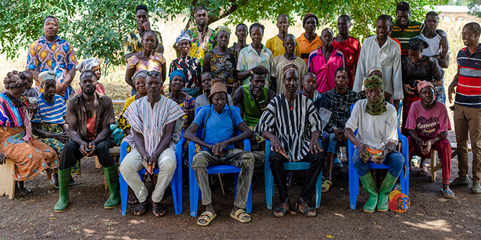
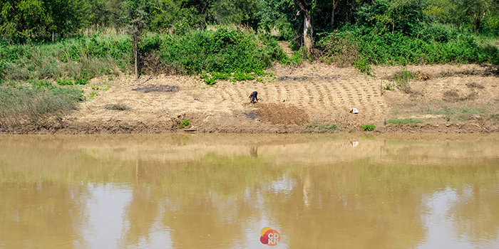
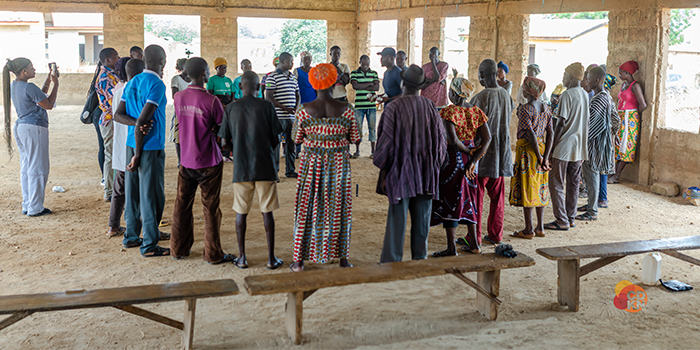
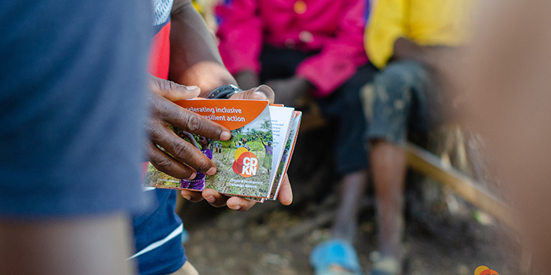

**Introduction**

According to Ghana’s Fourth National Communication (NC4) to the United Nations Framework on the Convention of Climate Change (UNFCCC), communities in the Upper West region are classified as some of the most vulnerable areas with high sensitivity to climate risks and low adaptive capacity. Yet , in the face of accelerating climate change impacts, communities in the region are actively engaging in diverse locally-led adaptation (LLA) strategies as a path to enhance their adaptive capacity.

As part of CDKN’s work on LLA, the Ghana team in line with its country strategy, engaged with some communities in three of the most vulnerable districts/municipalities in the region; the Lawra, Nandom and Jirapa districts. These engagements, aimed at enhancing the capacity of these vulnerable communities, focused on understanding their climate risks, impacts, agency, while also conducting needs assessments to help CDKN better identify the most needed information and tools for adaptation within these communities, through participatory approaches like farming juggle. This piece highlights key insights and learnings from these community engagements.

**Key insights: Climate risks, impacts and communities’ adaptive capacity**

In all three districts, the communities grapple with delayed planting seasons due to inconsistent rainfall patterns leading to widespread food insecurity for most part of the year. In a participatory exercise, one of the farmers in the Burutu community in Nandom district complained that his inability to provide food for his family is affecting his mental health.

> “In recent years, I am unable to rely on my farming livelihood to provide food and other resources for my family as I used to. As the head of the household who is responsible for the upkeep of my entire family, my inability to do so makes me think a lot these days”. – Farmer, Burutu Community.

To address the challenge, some communities are engaging in dry season gardening along the Black Volta river, growing drought-tolerant seeds and seeking loans from the village savings and loans associations (VSLAs) for farming. Farmers engaged in dry season farming are using local water harvesting techniques like Zai pits and half moon to conserve water for their crops. The youth, in particular, are exploring off-farm avenues, and migrating to cities for work during the dry season. However, this often proves to be a stopgap rather than a solution, as stable job opportunities remain elusive and deprives farming households of an active labour force.

Concurrently, non-climatic challenges like limited access to farming inputs and relevant information, exacerbate the situation, especially for women farmers. A women's group leader in Orbili lamented that the gender disparity in information access put them in a more vulnerable state:

> “Lacking personal radios, we depend on second-hand knowledge shared at our group meetings, often missing out on vital agricultural insights.” – Women group leader, Orbili

These risks eventually impact communities ability to implement strategies that enhance crop resilience for food security and maintain income levels.

In response to these risks, communities like Orbili (Lawra District) and Doggoh (Jirapa District) are adapting through interventions such as using homemade compost from crop residue as part of their agricultural practices, generating income by selling fuelwood to purchase inputs, and joining community groups to access needed information.

**Key learnings from communities**

The engagements with these communities have revealed several crucial learnings:

1. **Localized solutions:** Each community has developed unique adaptation strategies tailored to their specific challenges. This localized approach ensures that solutions are relevant and effective. For instance, community leaders often use by-laws and taboos (Example: it’s forbidden to farm on protected areas) to deter people from farming too close to the riverside or prevent indiscriminate bush burning.

2. **Community involvement and leadership:** Active participation and leadership from within the community are critical for successful adaptation. Communities are more likely to embrace strategies that they have played a role in developing.

3. **Importance of information dissemination:** Effective communication and information sharing are key in building resilience. Ensuring that tools like community radio and sensitization programs are inclusive helps in spreading awareness and educating community members about best adaptation practices. For instance, radio sessions are conducted in the local language, and community members are allowed to participate through phone-in sessions to participate in the discussions.

4. **Innovation and resourcefulness:** These communities demonstrate remarkable innovation and resourcefulness, from utilizing crop residues for compost to engaging in dry season gardening and other sustainable farming practices.

5. **Financial constraints and solutions:** Financial challenges are a common theme. Strategies like seeking loans for farming or selling fuelwood highlight the communities' efforts to overcome these obstacles.

**Conclusion**

The experiences of the Nandom, Lawra, and Nadowli communities in the Upper West region of Ghana provide valuable insights into community-led climate change adaptation. Even though challenges still persist, their strategies, centered on innovation, local leadership, and effective communication, offer a blueprint for other communities facing similar challenges. By understanding their specific risks and leveraging local knowledge and resources, these communities are paving the way towards a more resilient future in the face of climate change. The role of CDKN in Ghana is to continuously work with these communities to understand their risks and further explore innovative solutions for resilient communities.

This engagement not only empowers these communities but also offers vital lessons for global climate change adaptation efforts, emphasising the importance of locally-led initiatives and the power of community resilience.

_Catch up with us via our website [cdknghana](www.cdknghana.org) and across all social media platforms - [LinkedIn]()[Facebook](),[Instagram](),[YouTube](),[TikTok]()_

<!-- 

    

        
    

    

        
    

    

        
    

#### Old Education Needs For Change The World.

Contrary to popular belief, Lorem Ipsum is not simply random text. It has roots in a piece of classical literature from 459, making it over 2000 years old. Richard McClintock, a Latin professor at Virginia looked up one of the more obscure Latin words, consectetur, from a Lorem Ipsum passage, and going through the cites of the word in classical literature, discovered the undoubtable source. Lorem Ipsum comes from written in 45 BC. This book is a treatise on the theory.

Contrary to popular belief, Lorem Ipsum is not simply random text. It has roots in a piece of classical literature from 459, making it over 2000 years old. Richard McClintock, a Latin professor at Virginia looked up one of the more obscure Latin words, consectetur, from a Lorem Ipsum passage, and going through the cites of the word in classical literature. -->
